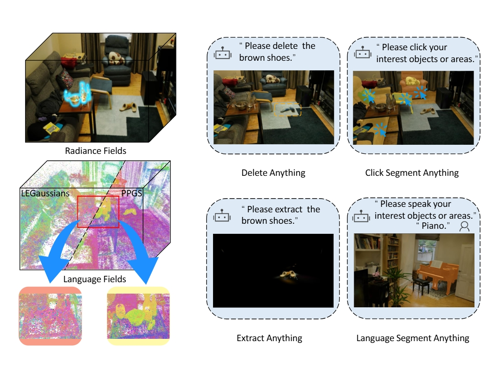

# PPGS: Enhancing Open-Vocabulary Scene Understanding via Push-Pull Alignment in Gaussian Splatting

[data](https://drive.google.com/drive/folders/1Ls5o_WuqxPG6jAxMKTG_F4p8XvJ-kA-P) | [checkpoints](https://drive.google.com/drive/folders/1Ls5o_WuqxPG6jAxMKTG_F4p8XvJ-kA-P)  <br>




## Setup

```bash
git clone https://github.com/flybiubiu/PPGS.git --recursive
cd PPGS

conda create -n ppgs python=3.9 -y
conda activate ppgs

pip install torch==2.4.1 torchvision==0.19.1 torchaudio==2.4.1 --index-url https://download.pytorch.org/whl/cu124

pip install tqdm plyfile timm open_clip_torch scipy six configargparse pysocks python-dateutil imageio seaborn opencv-python scikit-learn tensorboard Pillow==9.5.0

# Install local packages from the 'submodules' directory
# a modified gaussian splatting (+ semantic features rendering)
cd submodules/diff-gaussian-rasterization/ && python -m pip install -e . && cd ../..
# simple-knn
cd submodules/simple-knn/ && python -m pip install -e . && cd ../..
# segment-anything-langsplat
cd submodules/segment-anything-langsplat/ && python -m pip install -e . && cd ../..
```


## Preproccessing

We follow the preprocessing pipeline of LangSplat; however, since most existing methods focus on understanding performance, we do not distinguish between training and test splits.

## Training

We use the `train.py` script to train the model. The config file specifies data and output paths, training hyperparameters, test set, and language feature indices path. The configs for the Mip-NeRF 360 dataset are in the `./configs/mipnerf360` directory. 

```bash
python train.py --config configs/mipnerf360/xxx.cfg
```

You can modify the config file to train the model for other scenes or dataset.

## Rendering

We use the `render_mask.py` script to render rgbs, relevancy maps of text queries, and segmentation masks. The config file specifies the paths, queried texts, test set, rendering parameters and so on. The rendering configs for the Mip-NeRF 360 dataset are in the `./configs/mipnerf360-rendering` directory.

```bash
python render_mask.py --config configs/mipnerf360-rendering/xxx.cfg
```

Because the load of pretained model could be slow, you can modify the `train.py` to render the scene right after training. 

The output will be saved in the root directory of the checkpoint file, and it is orgniazed as follows:


## Evaluation


We use the `eval.py` script to evaluate the rendering results. Now, we need copy the segmentation masks from the dataset to the output directory and run the following command to evaluate the rendering results. In the future, we will optimize the evaluation process. The path is the output directory of the rendering results.

```bash
cp -r data/xxx/segmentations output/eval_xxx
python eval.py --path output/eval_xxx
```

After evaluation, you can get the visual quality and language querying accuracy of the rendering results. And detailed results of language metrics will be saved in the `lem_metrics.json` and `mAP_metrics.json` in the output directory.

## Acknowledgement

Credits to the authors for their excellent contributions in the following works:
- [3D Gaussians](https://repo-sam.inria.fr/fungraph/3d-gaussian-splatting/)
- [2D Gaussians](https://surfsplatting.github.io/)
- [LEGaussians](https://arxiv.org/pdf/2311.18482)
